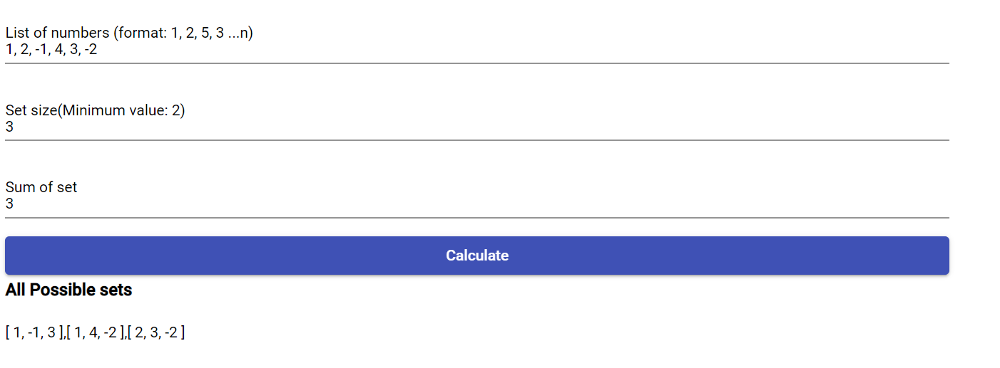

# Numbersetsfinder
This application search inside a set of numbers and find possible sets which sum is equal to provide value. 
**For example**:  
If Provided number set is `1, 2, 3, 5, 4, -1` and size of set is `2` and sum of subsets is `5` then all possible subsets are 
`[1, 4], [2, 3]`

Another example can be If Provided number set is `1, 2, 3, 5, 4, -1` and size of set is `3` and sum of subsets is `6` then all possible subsets are 
`[ 1, 2, 3 ], [ 2, 5, -1 ], [ 3, 4, -1 ]`

### Screen with one sample run

# Files containing logic
[Set Generator Service](./src/set-generater-service.ts) 
[Set Generator Service Test](./src/app/set-generater.service.spec.ts)
 
## Development server

Run `ng serve` for a dev server. Navigate to `http://localhost:4200/`. The app will automatically reload if you change any of the source files.

## Build

Run `ng build` to build the project. The build artifacts will be stored in the `dist/` directory. Use the `--prod` flag for a production build.

## Running unit tests

Run `ng test` to execute the unit tests via [Karma](https://karma-runner.github.io).